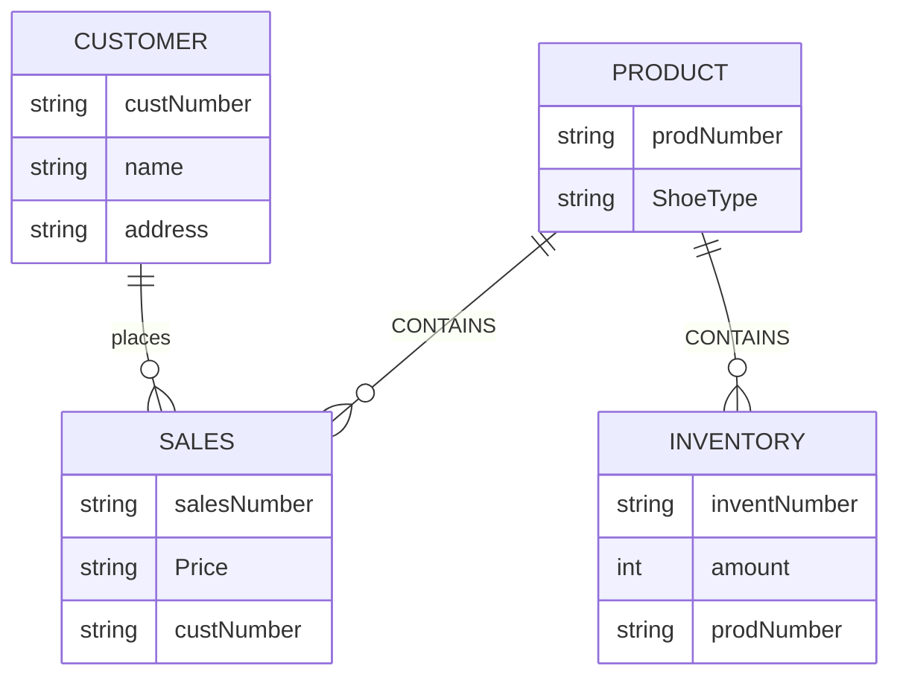

```mermaid
erDiagram
CUSTOMER ||-- o{ SALES : places
    CUSTOMER {
        string custNumber
        string name
        string address
    }
PRODUCT ||-- o{ SALES : CONTAINS
 PRODUCT { 
        string prodNumber
        string ShoeType
    }
 SALES { 
        string salesNumber
        string Price
        string  custNumber
    }
PRODUCT ||-- o{ INVENTORY : CONTAINS
 INVENTORY {
        string inventNumber
        int amount
        string prodNumber
    }
```
