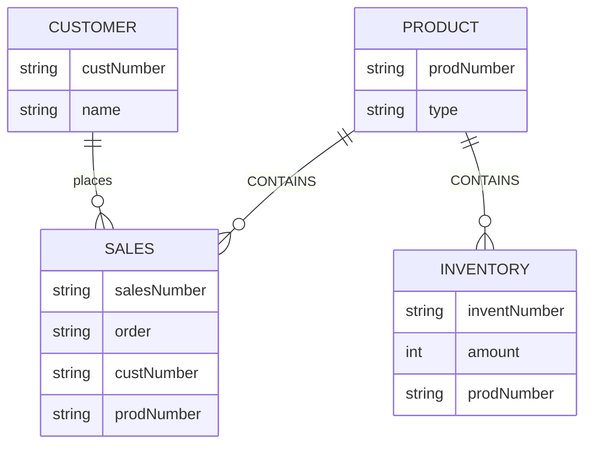

```mermaid
erDiagram
CUSTOMER ||-- o{ SALES : places
    CUSTOMER {
        string custNumber
        string name
    }
PRODUCT ||-- o{ SALES : CONTAINS
 PRODUCT { 
        string prodNumber
        string type
    }
 SALES { 
        string salesNumber
        string order
        string  custNumber
        string prodNumber
    }
PRODUCT ||-- o{ INVENTORY : CONTAINS
 INVENTORY {
        string inventNumber
        int amount
        string prodNumber
    }
```
